# AWS Serverless Data Pipeline

An event-driven ETL pipeline built on AWS that automatically ingests, transforms, catalogs, and queries retail sales data using serverless services.

The objective of this project was to build a production-inspired data engineering workflow where each stage is triggered automatically through AWS events, requiring no manual intervention after a dataset is uploaded.

---

# Architecture

The pipeline follows a fully serverless architecture using AWS managed services.

<p align="center">
    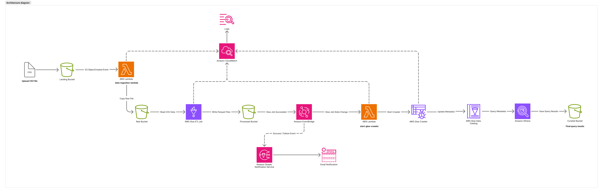
</p>

---

# Pipeline Workflow

```text
Upload File
      │
      ▼
Landing S3 Bucket
      │
      ▼
S3 Event Notification
      │
      ▼
AWS Lambda
(File Validation & Copy)
      │
      ▼
Raw S3 Bucket
      │
      ▼
Glue ETL Job
(Data Cleansing)
      │
      ▼
Processed S3 Bucket
      │
      ▼
Glue Transformation Job
      │
      ▼
Curated S3 Bucket
      │
      ├────────► Glue Crawler
      │              │
      │              ▼
      │       Glue Data Catalog
      │
      ├────────► CloudWatch Logs
      │
      ├────────► SNS Notifications
      │
      └────────► EventBridge Schedule
```

---

# AWS Services

| Service | Purpose |
|----------|---------|
| Amazon S3 | Store raw and processed datasets |
| AWS Lambda | Event-driven orchestration |
| AWS Glue | Data transformation |
| AWS Glue Crawler | Schema discovery |
| AWS Glue Data Catalog | Metadata management |
| Amazon Athena | Serverless SQL queries |
| Amazon EventBridge | Event routing |
| Amazon CloudWatch | Logging & monitoring |
| Amazon SNS | Email notifications |

---

# Implementation

## 1. Amazon S3

The pipeline begins with a CSV dataset uploaded to the Landing Bucket. An S3 ObjectCreated event automatically invokes the ingestion Lambda.

<p align="center">
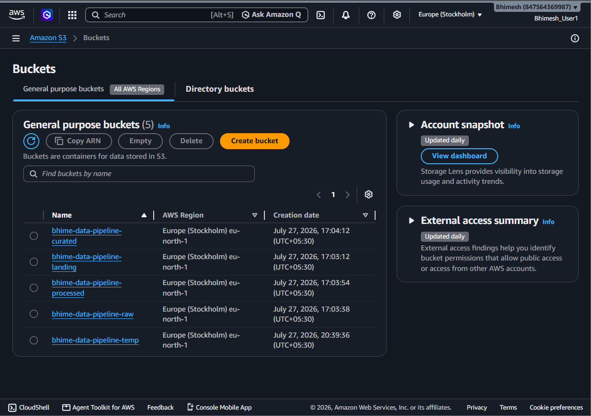
</p>

CSV file upload
<p align="center">
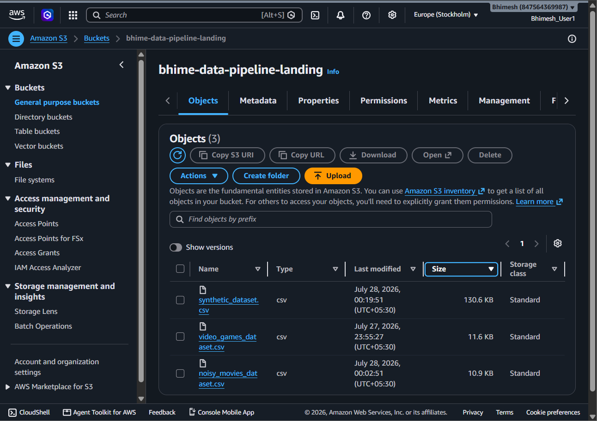
</p><p align="center">

This is a noisy dataset with over 4000+ rows
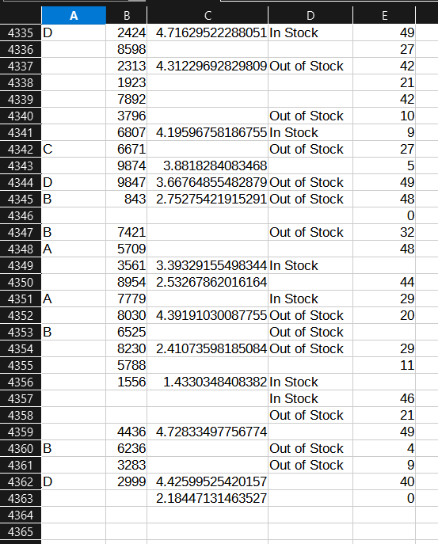
</p>
---

## 2. AWS Lambda

### Data Ingestion Lambda

Responsible for:

- Detecting new uploads
- Copying files to the Raw Bucket
- Starting the Glue ETL job

Source code for data-ingestion-lambda-function
<p align="center">
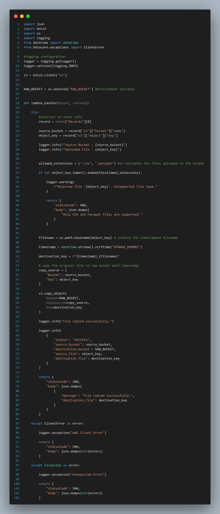
</p>

---

### Start Crawler Lambda

Triggered by EventBridge after a successful Glue ETL execution.

Responsibilities:

- Start Glue Crawler
- Handle crawler status
- Log execution to CloudWatch

<p align="center">
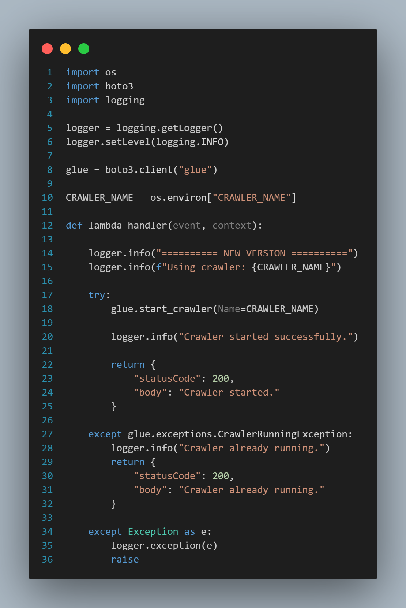
</p>

---

## 3. IAM Roles

Custom IAM roles were configured following the principle of least privilege for Lambda and AWS Glue.

<p align="center">

</p>

---

## 4. AWS Glue

AWS Glue performs the ETL process by reading raw CSV data, cleaning duplicate or invalid records, and writing the transformed dataset as Apache Parquet.

### Glue Database

<p align="center">
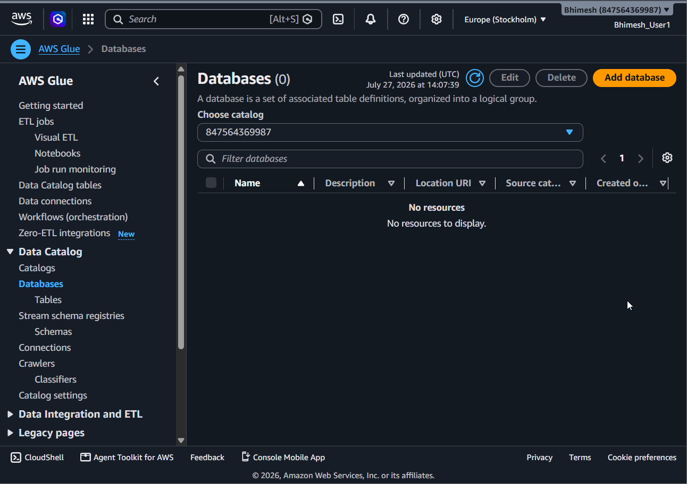
</p>

### Database Creation

<p align="center">
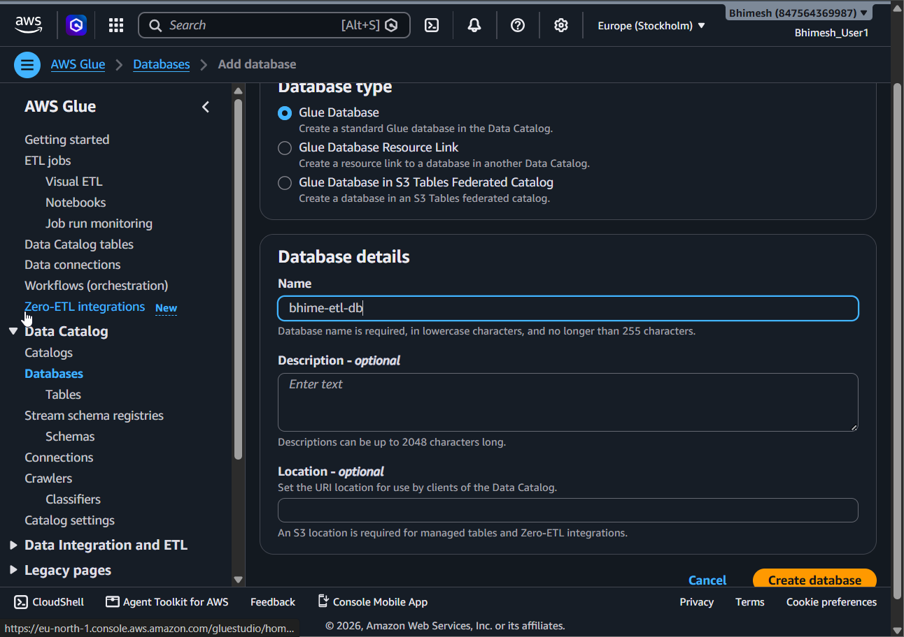
</p>

### IAM Role

<p align="center">
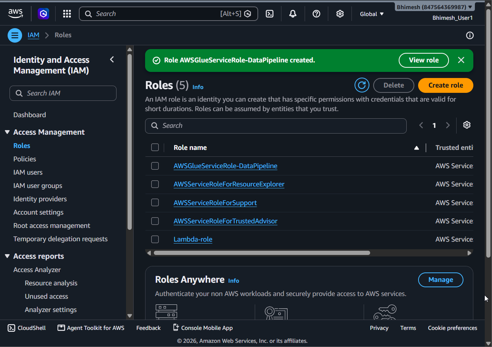
</p>

### Glue Job

<p align="center">
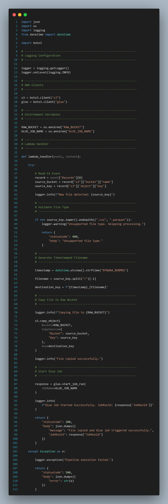
</p>

### Final Database

<p align="center">
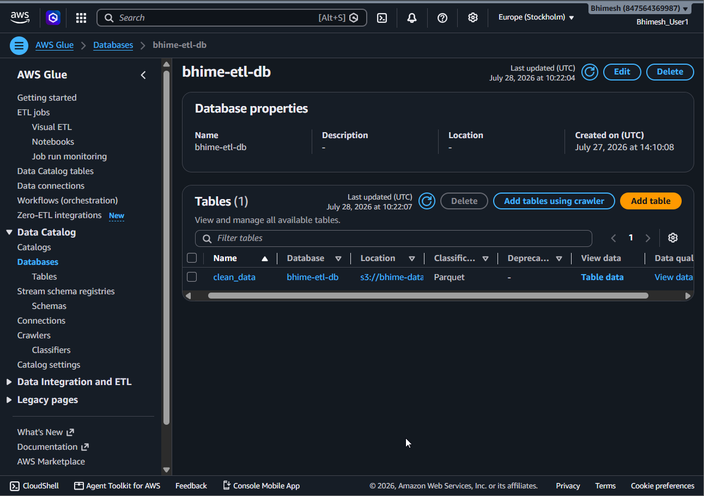
</p>

---

## 5. Amazon EventBridge

After the Glue ETL job completes successfully, EventBridge automatically triggers the crawler Lambda.

<p align="center">
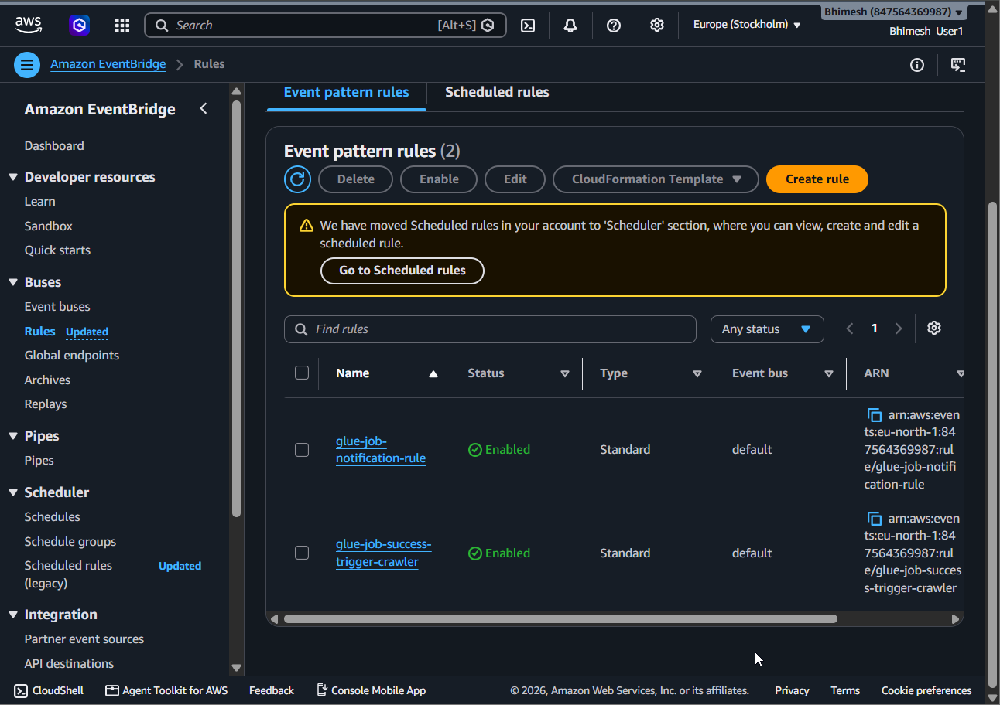
</p>

---

## 6. AWS Glue Crawler

The crawler scans the processed Parquet files and updates the Glue Data Catalog.

<p align="center">
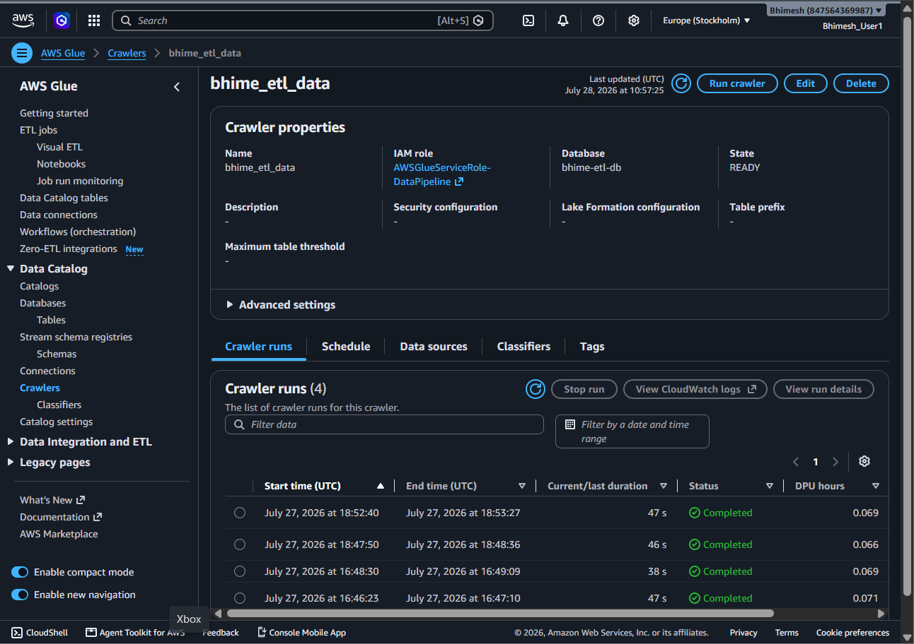
</p>

---

## 7. Amazon Athena

Athena provides serverless SQL querying over the processed dataset stored in Amazon S3.

Example query:

```sql
SELECT *
FROM clean_data
LIMIT 10;
```

<p align="center">
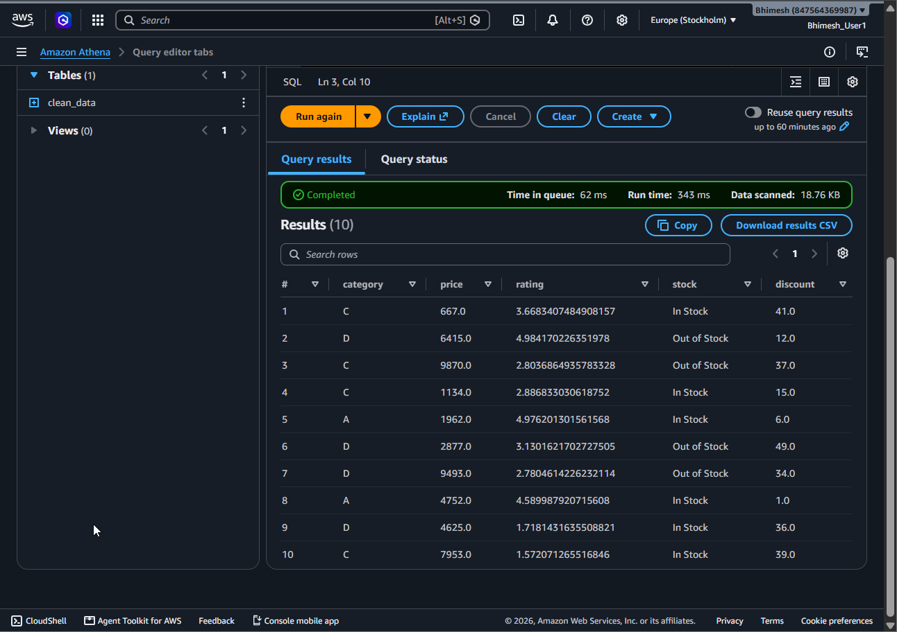
</p>

---

## 8. Curated Output

The processed data is available in Parquet format for downstream analytics and reporting.

<p align="center">

</p>

---

## 9. Monitoring

Amazon CloudWatch captures logs from Lambda functions, Glue ETL jobs, and Glue Crawlers, providing centralized monitoring for the entire workflow.

<p align="center">
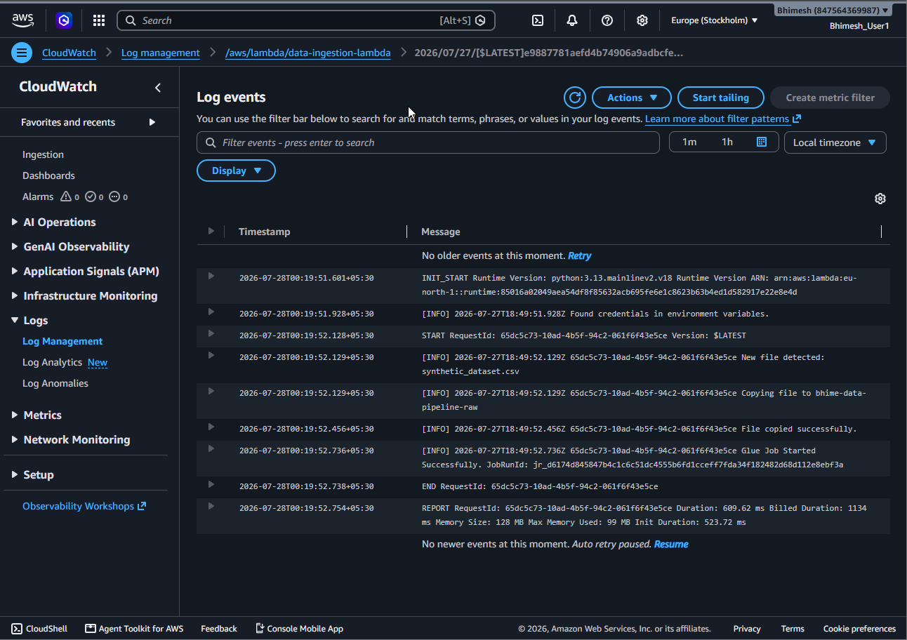
</p>

---

## 10. Notifications

Amazon SNS delivers email notifications for configured pipeline events.

### SNS Topic

<p align="center">
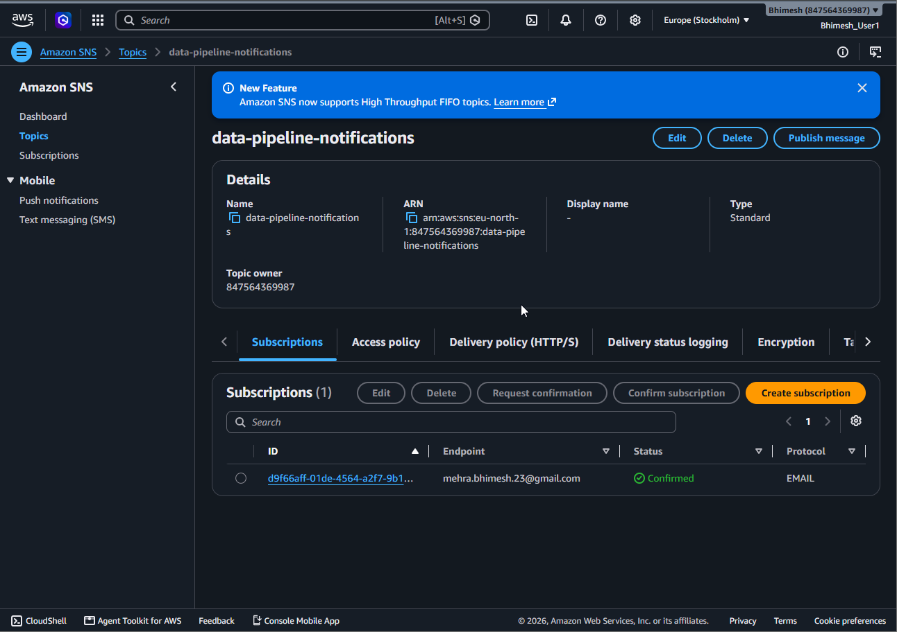
</p>

### Email Notification

<p align="center">
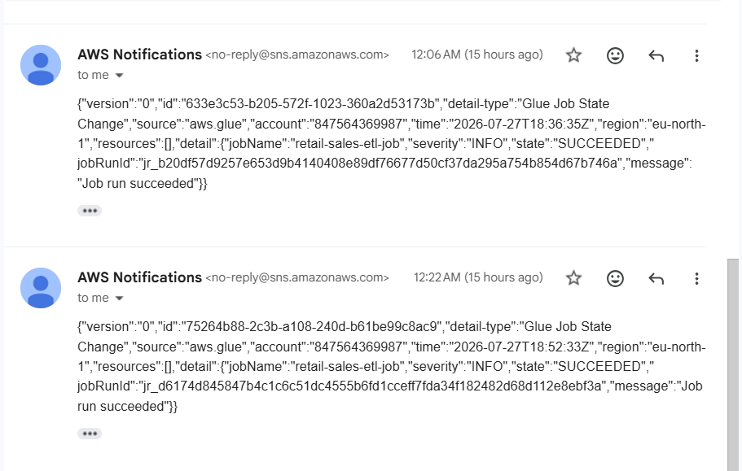
</p>

---

# Sample Athena Query

```sql
SELECT region,
       SUM(total_amount) AS revenue
FROM clean_data
GROUP BY region
ORDER BY revenue DESC;
```

---

# Key Design Decisions

- Adopted an event-driven architecture to automate every stage of the pipeline.
- Converted CSV files to Apache Parquet to reduce storage usage and improve query performance.
- Used EventBridge to decouple Glue completion from crawler execution.
- Leveraged the Glue Data Catalog for schema management and serverless querying.
- Centralized logging through CloudWatch and notifications through SNS for improved observability.

---

# Future Improvements

- Infrastructure as Code using Terraform
- CI/CD with GitHub Actions
- Partitioned Parquet datasets
- Data quality validation
- Amazon QuickSight dashboards
- Schema evolution handling

---

# Technologies

- Python
- Amazon S3
- AWS Lambda
- AWS Glue
- Amazon EventBridge
- AWS Glue Data Catalog
- Amazon Athena
- Amazon CloudWatch
- Amazon SNS
